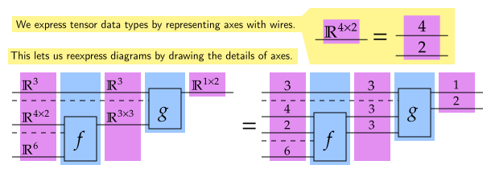
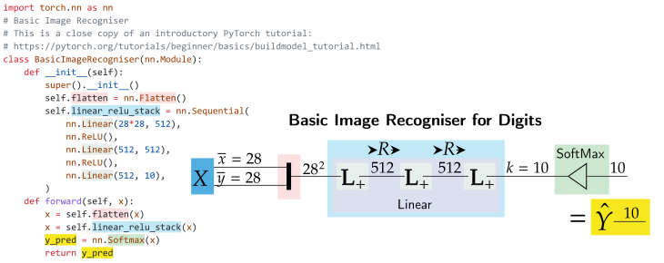
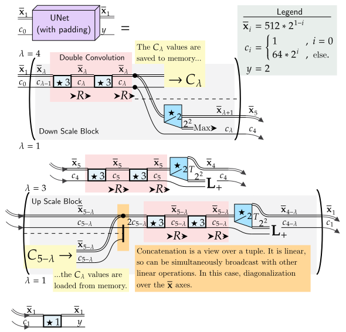

```python
import torch
import typing
import functorch
import itertools
```

# 2.3 Tensors
### We diagrams tensors, which can be vertically and horizontally decomposed.



```python
# This diagram shows a function h : 3, 4 2, 6 -> 1 2 constructed out of f: 4 2, 6 -> 3 3 and g: 3, 3 3 -> 1 2
# We use assertions and random outputs to represent generic functions, and how diagrams relate to code.
T = torch.Tensor
def f(x0 : T, x1 : T):
    """ f: 4 2, 6 -> 3 3 """
    assert x0.size() == torch.Size([4,2])
    assert x1.size() == torch.Size([6])
    return torch.rand([3,3])
def g(x0 : T, x1: T):
    """ g: 3, 3 3 -> 1 2 """
    assert x0.size() == torch.Size([3])
    assert x1.size() == torch.Size([3, 3])
    return torch.rand([1,2])
def h(x0 : T, x1 : T, x2 : T):
    """ h: 3, 4 2, 6 -> 1 2"""
    assert x0.size() == torch.Size([3])
    assert x1.size() == torch.Size([4, 2])
    assert x2.size() == torch.Size([6])
    return g(x0, f(x1,x2))

h(torch.rand([3]), torch.rand([4, 2]), torch.rand([6]))
```


    tensor([[0.6837, 0.6853]])


## 2.3.1 Indexes
### Figure 8: Indexes


```python
# Extracting a subtensor is a process we are familiar with. Consider,
# A (4 3) tensor
table = torch.arange(0,12).view(4,3)
row = table[2,:]
row
```


    tensor([6, 7, 8])


### Figure 9: Subtensors


```python
# Different orders of access give the same result.
# Set up a random (5 7) tensor
a, b = 5, 7
Xab = torch.rand([a] + [b])
# Show that all pairs of indexes give the same result
for ia, jb in itertools.product(range(a), range(b)):
    assert Xab[ia, jb] == Xab[ia, :][jb]
    assert Xab[ia, jb] == Xab[:, jb][ia]
```

## 2.3.2 Broadcasting
### Figure 10: Broadcasting


```python
a, b, c, d = [3], [2], [4], [3]
T = torch.Tensor

# We have some function from a to b;
def G(Xa: T) -> T:
    """ G: a -> b """
    return sum(Xa**2) + torch.ones(b)

# We could bootstrap a definition of broadcasting,
# Note that we are using spaces to indicate tensoring. 
# We will use commas for tupling, which is in line with standard notation while writing code.
def Gc(Xac: T) -> T:
    """ G c : a c -> b c """
    Ybc = torch.zeros(b + c)
    for j in range(c[0]):
        Ybc[:,jc] = G(Xac[:,jc])
    return Ybc

# Or use a PyTorch command,
# G *: a * -> b *
Gs = torch.vmap(G, -1, -1)

# We feed a random input, and see whether applying an index before or after
# gives the same result.
Xac = torch.rand(a + c)
for jc in range(c[0]):
    assert torch.allclose(G(Xac[:,jc]), Gc(Xac)[:,jc])
    assert torch.allclose(G(Xac[:,jc]), Gs(Xac)[:,jc])

# This shows how our definition of broadcasting lines up with that used by PyTorch vmap.
```

### Figure 11: Inner Broadcasting


```python
a, b, c, d = [3], [2], [4], [3]
T = torch.Tensor

# We have some function which can be inner broadcast,
def H(Xa: T, Xd: T) -> T:
    """ H: a, d -> b """
    return torch.sum(torch.sqrt(Xa**2)) + torch.sum(torch.sqrt(Xd ** 2))  + torch.ones(b)

# We can bootstrap inner broadcasting,
def Hc0(Xca: T, Xd : T) -> T:
    """ c0 H: c a, d -> c d """
     # Recall that we defined a, b, c, d in [_] arrays.
    Ycb = torch.zeros(c + b)
    for ic in range(c[0]):
        Ycb[ic,  :] = H(Xca[ic, :], Xd)
    return Ycb

# But vmap offers a clear way of doing it,
# *0 H: * a, d -> * c
Hs0 = torch.vmap(H, (0, None), 0)

# We can show this satisfies Definition 2.14 by,
Xca = torch.rand(c + a)
Xd = torch.rand(d)
for ic in range(c[0]):
    assert torch.allclose(Hc0(Xca, Xd)[ic, :], H(Xca[ic, :], Xd))
    assert torch.allclose(Hs0(Xca, Xd)[ic, :], H(Xca[ic, :], Xd))

```

### Figure 12 Elementwise operations


```python

# Elementwise operations are implemented as usual ie
def f(x):
    "f : 1 -> 1"
    return x ** 2

# We broadcast an elementwise operation,
# f *: * -> *
fs = torch.vmap(f)

Xa = torch.rand(a)
for i in range(a[0]):
    # And see that it aligns with the index before = index after framework.
    assert torch.allclose(f(Xa[i]), fs(Xa)[i])
    # But, elementwise operations are implied, so no special implementation is needed. 
    assert torch.allclose(f(Xa[i]), f(Xa)[i])
```

# 2.4 Linearity
## 2.4.2 Implementing Linearity and Common Operations
### Figure 17: Multi-head Attention and Einsum


```python
import math
import einops
x, y, k, h = 5, 3, 4, 2
Q = torch.rand([y, k, h])
K = torch.rand([x, k, h])

# Local memory contains,
# Q: y k h # K: x k h
# Outer products, transposes, inner products, and
# diagonalization reduce to einops expressions.
# Transpose K,
K = einops.einsum(K, 'x k h -> k x h')
# Outer product and diagonalize,
X = einops.einsum(Q, K, 'y k1 h, k2 x h -> y k1 k2 x h')
# Inner product,
X = einops.einsum(X, 'y k k x h -> y x h')
# Scale,
X = X / math.sqrt(k)

Q = torch.rand([y, k, h])
K = torch.rand([x, k, h])

# Local memory contains,
# Q: y k h # K: x k h
X = einops.einsum(Q, K, 'y k h, x k h -> y x h')
X = X / math.sqrt(k)

```

## 2.4.3 Linear Algebra
### Figure 18: Graphical Linear Algebra


```python
# We will do an exercise implementing some of these equivalences.
# The reader can follow this exercise to get a better sense of how linear functions can be implemented,
# and how different forms are equivalent.

a, b, c, d = [3], [4], [5], [3]

# We will be using this function *a lot*
es = einops.einsum

# F: a b c
F_matrix = torch.rand(a + b + c)

# As an exericse we will show that the linear map F: a -> b c can be transposed in two ways.
# Either, we can broadcast, or take an outer product. We will show these are the same.

# Transposing by broadcasting
# 
def F_func(Xa: T):
    """ F: a -> b c """
    return es(Xa,F_matrix,'a,a b c->b c',)
# * F: * a -> * b c
F_broadcast = torch.vmap(F_func, 0, 0)

# We then reduce it, as in the diagram,
# b a -> b b c -> c
def F_broadcast_transpose(Xba: T):
    """ (b F) (.b c): b a -> c """
    Xbbc = F_broadcast(Xba)
    return es(Xbbc, 'b b c -> c')

# Transpoing by linearity
#
# We take the outer product of Id(b) and F, and follow up with a inner product.
# This gives us,
F_outerproduct = es(torch.eye(b[0]), F_matrix,'b0 b1, a b2 c->b0 b1 a b2 c',)
# Think of this as Id(b) F: b0 a -> b1 b2 c arranged into an associated b0 b1 a b2 c tensor.
# We then take the inner product. This gives a (b a c) matrix, which can be used for a (b a -> c) map.
F_linear_transpose = es(F_outerproduct,'b B a B c->b a c',)

# We contend that these are the same.
#
Xba = torch.rand(b + a)
assert torch.allclose(
    F_broadcast_transpose(Xba), 
    es(Xba,F_linear_transpose, 'b a, b a c -> c'))

# Furthermore, lets prove the unit-inner product identity.
#
# The first step is an outer product with the unit,
outerUnit = lambda Xb: es(Xb, torch.eye(b[0]), 'b0, b1 b2 -> b0 b1 b2')
# The next is a inner product over the first two axes,
dotOuter = lambda Xbbb: es(Xbbb, 'b0 b0 b1 -> b1')
# Applying both of these *should* be the identity, and hence leave any input unchanged.
Xb = torch.rand(b)
assert torch.allclose(
    Xb,
    dotOuter(outerUnit(Xb)))

# Therefore, we can confidently use the expressions in Figure 18 to manipulate expressions.
```

# 3.1 Basic Multi-Layer Perceptron
### Figure 19: Implementing a Basic Multi-Layer Perceptron



```python
import torch.nn as nn
# Basic Image Recogniser
# This is a close copy of an introductory PyTorch tutorial:
# https://pytorch.org/tutorials/beginner/basics/buildmodel_tutorial.html
class BasicImageRecogniser(nn.Module):
    def __init__(self):
        super().__init__()
        self.flatten = nn.Flatten()
        self.linear_relu_stack = nn.Sequential(
        nn.Linear(28*28, 512),
        nn.ReLU(),
        nn.Linear(512, 512),
        nn.ReLU(),
        nn.Linear(512, 10),
    )
    def forward(self, x):
        x = self.flatten(x)
        x = self.linear_relu_stack(x)
        y_pred = nn.Softmax(x)
        return y_pred
    
my_BasicImageRecogniser = BasicImageRecogniser()
my_BasicImageRecogniser.forward(torch.rand([1,28,28]))
```


    Softmax(
      dim=tensor([[ 0.0150, -0.0301,  0.1395, -0.0558,  0.0024, -0.0613, -0.0163,  0.0134,
                0.0577, -0.0624]], grad_fn=<AddmmBackward0>)
    )


# 3.2 Neural Circuit Diagrams for the Transformer Architecture
### Figure 20: Scaled Dot-Product Attention


```python
# Note, that we need to accomodate batches, hence the ... to capture additional axes.

# We can do the algorithm step by step,
def ScaledDotProductAttention(q: T, k: T, v: T) -> T:
    ''' yk, xk, xk -> yk '''
    klength = k.size()[-1]
    # Transpose
    k = einops.einsum(k,    '... x k -> ... k x')
    # Matrix Multiply / Inner Product
    x = einops.einsum(q, k, '... y k, ... k x -> ... y x')
    # Scale
    x = x / math.sqrt(klength)
    # SoftMax
    x = torch.nn.Softmax(-1)(x)
    # Matrix Multiply / Inner Product
    x = einops.einsum(x, v, '... y x, ... x k -> ... y k')
    return x

# Alternatively, we can simultaneously broadcast linear functions.
def ScaledDotProductAttention(q: T, k: T, v: T) -> T:
    ''' yk, xk, xk -> yk '''
    klength = k.size()[-1]
    # Inner Product and Scale
    x = einops.einsum(q, k, '... y k, ... x k -> ... y x')
    # Scale and SoftMax 
    x = torch.nn.Softmax(-1)(x / math.sqrt(klength))
    # Final Inner Product
    x = einops.einsum(x, v, '... y x, ... x k -> ... y k')
    return x
```

### Figure 21: Multi-Head Attention


We will be implementing this algorithm. This shows us how we go from diagrams to implementations, and begins to give an idea of how organized diagrams leads to organized code.


```python
def MultiHeadDotProductAttention(q: T, k: T, v: T) -> T:
    ''' ykh, xkh, xkh -> ykh '''
    klength = k.size()[-2]
    x = einops.einsum(q, k, '... y k h, ... x k h -> ... y x h')
    x = torch.nn.Softmax(-2)(x / math.sqrt(klength))
    x = einops.einsum(x, v, '... y x h, ... x k h -> ... y k h')
    return x

# We implement this component as a neural network model.
# This is necessary when there are bold, learned components that need to be initialized.
class MultiHeadAttention(nn.Module):
    # Multi-Head attention has various settings, which become variables
    # for the initializer.
    def __init__(self, m, k, h):
        super().__init__()
        self.m, self.k, self.h = m, k, h
        # Set up all the boldface, learned components
        # Note how they bind axes we want to split, which we do later with einops.
        self.Lq = nn.Linear(m, k*h, False)
        self.Lk = nn.Linear(m, k*h, False)
        self.Lv = nn.Linear(m, k*h, False)
        self.Lo = nn.Linear(k*h, m, False)


    # We have endogenous data (Eym) and external / injected data (Xxm)
    def forward(self, Eym, Xxm):
        """ y m, x m -> y m """
        # We first generate query, key, and value vectors.
        # Linear layers are automatically broadcast.

        # However, the k and h axes are bound. We define an unbinder to handle the outputs,
        unbind = lambda x: einops.rearrange(x, '... (k h)->... k h', h=self.h)
        q = unbind(self.Lq(Eym))
        k = unbind(self.Lk(Xxm))
        v = unbind(self.Lv(Xxm))

        # We feed q, k, and v to standard Multi-Head inner product Attention
        o = MultiHeadDotProductAttention(q, k, v)

        # Rebind to feed to the final learned layer,
        o = einops.rearrange(o, '... k h-> ... (k h)', h=self.h)
        return self.Lo(o)

# Now we can run it on fake data;
y, x, m, jc, heads = [20], [22], [128], [16], 4
# Internal Data
Eym = torch.rand(y + m)
# External Data
Xxm = torch.rand(x + m)

mha = MultiHeadAttention(m[0],jc[0],heads)
assert list(mha.forward(Eym, Xxm).size()) == y + m

```

# 3.4 Computer Vision

Here, we really start to understand why splitting diagrams into ``fenced off'' blocks aids implementation. 
In addition to making diagrams easier to understand and patterns more clearn, blocks indicate how code can structured and organized.

## Figure 26: Identity Residual Network


```python
# For Figure 26, every fenced off region is its own module.

# Batch norm and then activate is a repeated motif,
class NormActivate(nn.Sequential):
    def __init__(self, nf, Norm=nn.BatchNorm2d, Activation=nn.ReLU):
        super().__init__(Norm(nf), Activation())

def size_to_string(size):
    return " ".join(map(str,list(size)))

# The Identity ResNet block breaks down into a manageable sequence of components.
class IdentityResNet(nn.Sequential):
    def __init__(self, N=3, n_mu=[16,64,128,256], y=10):
        super().__init__(
            nn.Conv2d(3, n_mu[0], 3, padding=1),
            Block(1, N, n_mu[0], n_mu[1]),
            Block(2, N, n_mu[1], n_mu[2]),
            Block(2, N, n_mu[2], n_mu[3]),
            NormActivate(n_mu[3]),
            nn.AdaptiveAvgPool2d(1),
            nn.Flatten(),
            nn.Linear(n_mu[3], y),
            nn.Softmax(-1),
            )
```

The Block can be defined in a seperate model, keeping the code manageable and closely connected to the diagram.


```python
# We then follow how diagrams define each ``block''
class Block(nn.Sequential):
    def __init__(self, s, N, n0, n1):
        """ n0 and n1 as inputs to the initializer are implicit from having them in the domain and codomain in the diagram. """
        nb = n1 // 4
        super().__init__(
            *[
            NormActivate(n0),
            ResidualConnection(
                nn.Sequential(
                    nn.Conv2d(n0, nb, 1, s),
                    NormActivate(nb),
                    nn.Conv2d(nb, nb, 3, padding=1),
                    NormActivate(nb),
                    nn.Conv2d(nb, n1, 1),
                ),
                nn.Conv2d(n0, n1, 1, s),
            )
            ] + [
            ResidualConnection(
                nn.Sequential(
                    NormActivate(n1),
                    nn.Conv2d(n1, nb, 1),
                    NormActivate(nb),
                    nn.Conv2d(nb, nb, 3, padding=1),
                    NormActivate(nb),
                    nn.Conv2d(nb, n1, 1)
                ),
                )
            ] * N
            
            )   
# Residual connections are a repeated pattern in the diagram. So, we are motivated to encapsulate them
# as a seperate module.
class ResidualConnection(nn.Module):
    def __init__(self, mainline : nn.Module, connection : nn.Module | None = None) -> None:
        super().__init__()
        self.main = mainline
        self.secondary = nn.Identity() if connection == None else connection
    def forward(self, x):
        return self.main(x) + self.secondary(x)
```


```python
# A standard image processing algorithm has inputs shaped b c h w.
b, c, hw = [3], [3], [16, 16]

idresnet = IdentityResNet()
Xbchw = torch.rand(b + c + hw)

# And we see if the overall size is maintained,
assert list(idresnet.forward(Xbchw).size()) == b + [10]
```

The UNet is a more complicated algorithm than residual networks. The ``fenced off'' sections help keep our code organized. Diagrams streamline implementation, and helps keep code organized.

## Figure 27: The UNet architecture



```python
# We notice that double convolution where the numbers of channels change is a repeated motif.
# We denote the input with c0 and output with c1. 
# This can also be done for subsequent members of an iteration.
# When we go down an iteration eg. 5, 4, etc. we may have the input be c1 and the output c0.
class DoubleConvolution(nn.Sequential):
    def __init__(self, c0, c1, Activation=nn.ReLU):
        super().__init__(
            nn.Conv2d(c0, c1, 3, padding=1),
            Activation(),
            nn.Conv2d(c0, c1, 3, padding=1),
            Activation(),
            )

# The model is specified for a very specific number of layers,
# so we will not make it very flexible.
class UNet(nn.Module):
    def __init__(self, y=2):
        super().__init__()
        # Set up the channel sizes;
        c = [1 if i == 0 else 64 * 2 ** i for i in range(6)]

        # Saving and loading from memory means we can not use a single,
        # sequential chain.

        # Set up and initialize the components;
        self.DownScaleBlocks = [
            DownScaleBlock(c[i],c[i+1])
            for i in range(0,4)
        ] # Note how this imitates the lambda operators in the diagram.
        self.middleDoubleConvolution = DoubleConvolution(c[4], c[5])
        self.middleUpscale = nn.ConvTranspose2d(c[5], c[4], 2, 2, 1)
        self.upScaleBlocks = [
            UpScaleBlock(c[5-i],c[4-i])
            for i in range(1,4)
        ]
        self.finalConvolution = nn.Conv2d(c[1], y)

    def forward(self, x):
        cLambdas = []
        for dsb in self.DownScaleBlocks:
            x, cLambda = dsb(x)
            cLambdas.append(cLambda)
        x = self.middleDoubleConvolution(x)
        x = self.middleUpscale(x)
        for usb in self.upScaleBlocks:
            cLambda = cLambdas.pop()
            x = usb(x, cLambda)
        x = self.finalConvolution(x)

class DownScaleBlock(nn.Module):
    def __init__(self, c0, c1) -> None:
        super().__init__()
        self.doubleConvolution = DoubleConvolution(c0, c1)
        self.downScaler = nn.MaxPool2d(2, 2, 1)
    def forward(self, x):
        cLambda = self.doubleConvolution(x)
        x = self.downScaler(cLambda)
        return x, cLambda

class UpScaleBlock(nn.Module):
    def __init__(self, c1, c0) -> None:
        super().__init__()
        self.doubleConvolution = DoubleConvolution(2*c1, c1)
        self.upScaler = nn.ConvTranspose2d(c1,c0,2,2,1)
    def forward(self, x, cLambda):
        # Concatenation occurs over the C channel axis (dim=1)
        x = torch.concat(x, cLambda, 1)
        x = self.doubleConvolution(x)
        x = self.upScaler(x)
        return x
```

# 3.5 Vision Transformer

We adapt our code for Multi-Head Attention to apply it to the vision case. This is a good exercise in how neural circuit diagrams allow code to be easily adapted for new modalities.
## Figure 28: Visual Attention


```python
class VisualAttention(nn.Module):
    def __init__(self, c, k, heads = 1, kernel = 1, stride = 1):
        super().__init__()
        
        # w gives the kernel size, which we make adjustable.
        self.c, self.k, self.h, self.w = c, k, heads, kernel
        # Set up all the boldface, learned components
        # Note how standard components may not have axes bound in 
        # the same way as diagrams. This requires us to rearrange
        # using the einops package.

        # The learned layers form convolutions
        self.Cq = nn.Conv2d(c, k * heads, kernel, stride)
        self.Ck = nn.Conv2d(c, k * heads, kernel, stride)
        self.Cv = nn.Conv2d(c, k * heads, kernel, stride)
        self.Co = nn.ConvTranspose2d(
                            k * heads, c, kernel, stride)

    # Defined previously, closely follows the diagram.
    def MultiHeadDotProductAttention(self, q: T, k: T, v: T) -> T:
        ''' ykh, xkh, xkh -> ykh '''
        klength = k.size()[-2]
        x = einops.einsum(q, k, '... y k h, ... x k h -> ... y x h')
        x = torch.nn.Softmax(-2)(x / math.sqrt(klength))
        x = einops.einsum(x, v, '... y x h, ... x k h -> ... y k h')
        return x

    # We have endogenous data (EYc) and external / injected data (XXc)
    def forward(self, EcY, XcX):
        """ cY, cX -> cY 
        The visual attention algorithm. Injects information from Xc into Yc. """
        # query, key, and value vectors.
        # We unbind the k h axes which were produced by the convolutions, and feed them
        # in the normal manner to MultiHeadDotProductAttention.
        unbind = lambda x: einops.rearrange(x, 'N (k h) H W -> N (H W) k h', h=self.h)
        # Save size to recover it later
        q = self.Cq(EcY)
        W = q.size()[-1]

        # By appropriately managing the axes, minimal changes to our previous code
        # is necessary.
        q = unbind(q)
        k = unbind(self.Ck(XcX))
        v = unbind(self.Cv(XcX))
        o = self.MultiHeadDotProductAttention(q, k, v)

        # Rebind to feed to the transposed convolution layer.
        o = einops.rearrange(o, 'N (H W) k h -> N (k h) H W', 
                             h=self.h, W=W)
        return self.Co(o)

# Single batch element,
b = [1]
Y, X, c, k = [16, 16], [16, 16], [33], 8
# The additional configurations,
heads, kernel, stride = 4, 3, 3

# Internal Data,
EYc = torch.rand(b + c + Y)
# External Data,
XXc = torch.rand(b + c + X)

# We can now run the algorithm,
visualAttention = VisualAttention(c[0], k, heads, kernel, stride)

# Interestingly, the height/width reduces by 1 for stride
# values above 1. Otherwise, it stays the same.
visualAttention.forward(EYc, XXc).size()
```


    torch.Size([1, 33, 15, 15])


# Appendix


```python
# A container to track the size of modules,
# Replace a module definition eg.
# > self.Cq = nn.Conv2d(c, k * heads, kernel, stride)
# With;
# > self.Cq = Tracker(nn.Conv2d(c, k * heads, kernel, stride), "Query convolution")
# And the input / output sizes (to check diagrams) will be printed.
class Tracker(nn.Module):
    def __init__(self, module: nn.Module, name : str = ""):
        super().__init__()
        self.module = module
        if name:
            self.name = name
        else:
            self.name = self.module._get_name()
    def forward(self, x):
        x_size = size_to_string(x.size())
        x = self.module.forward(x)
        y_size = size_to_string(x.size())
        print(f"{self.name}: \t {x_size} -> {y_size}")
        return x
```
